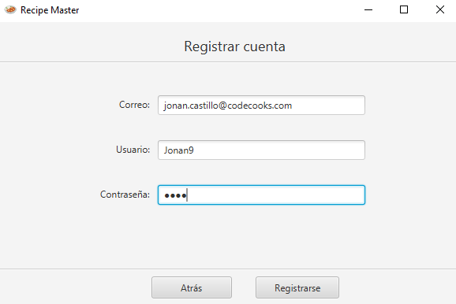
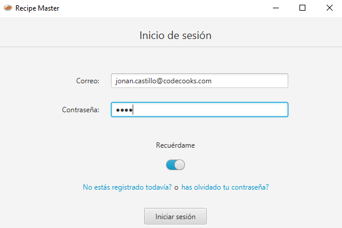
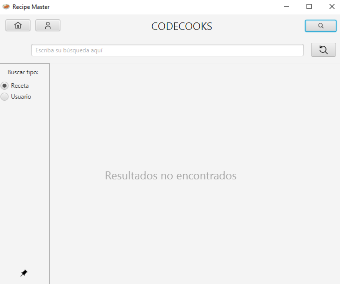
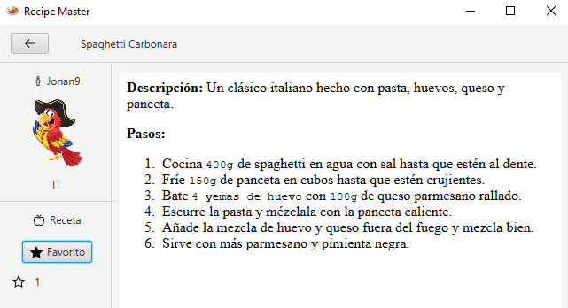
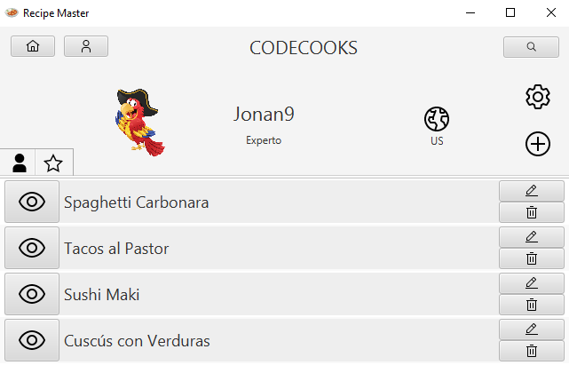
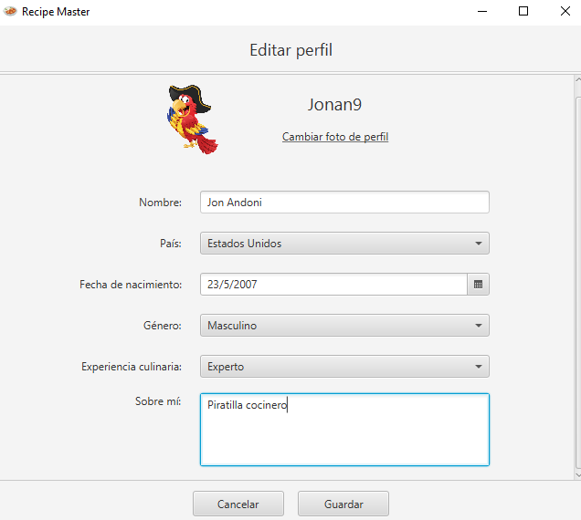
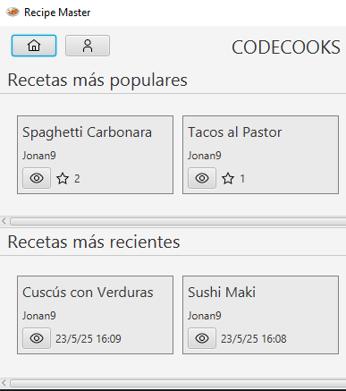

# 🍲 Recipe Master


## About The Project
**Recipe Master** is a social networking platform for sharing and discovering recipes worldwide.  
Developed by León Abascal, Jon Andoni Castillo, Hazal Demirci, Bidatz Beroiz, and Iñigo de Dios  
as part of the *Software Process and Quality* course, the project applies Agile practices  
using the Scrum framework.

The team has been structured into roles:
- The **Scrum Master** manages tasks and workflow via YouTrack.
- The **Product Owner** ensures the delivery of valuable features.
- **Developers** implement functionalities and track progress.

Recipe Master combines practical software development with a passion for food,  
creating a space for global culinary connection.
## Developed With


## Features

- 🆕 Register user accounts.



- 🔐 Login with existing accounts and remember email if needed.



- 🔍 Search for recipes/users for some social interaction.




- ✍️ View and create recipes written using markdown.



- 📚 Manage your own list of recipe posts and favourites.



- 🧑‍🍳 Create a rich user profile.



- 🏠 Access home to check most popular recipes and recent additions.




## Getting Started
This guide will help you set up and run the project.

### Prerequisites
Before you begin, ensure you have the following installed:
 - Java 11
 - Apache Maven
 - Docker (MongoDB)

### Running Locally (Dev)

Run a MongoDB database instance in a Docker container:
```shell
docker run --name recipe-master-mongo -p 27017:27017 -d mongo:4.4
```
Run the following command from the root folder:
```shell
mvn clean && mvn clean install
```

Go to the back-end folder and run the commands below. Keep the back-end running in the background:
```shell
cd back-end
mvn compile && mvn exec:java
```
Open a new terminal, go to the front-end folder, and run:

```shell
cd front-end
mvn javafx:run
```

## Docs
Check the auto-generated [documentation](https://spqe21-22.github.io/BSPQ22-E5).

## Contributors
<a href="https://github.com/Andowna9/Recipe-Master/graphs/contributors">
  
</a>

## License
Distributed under the Apache License. See [License](LICENSE).

